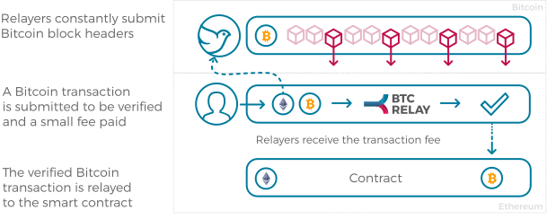
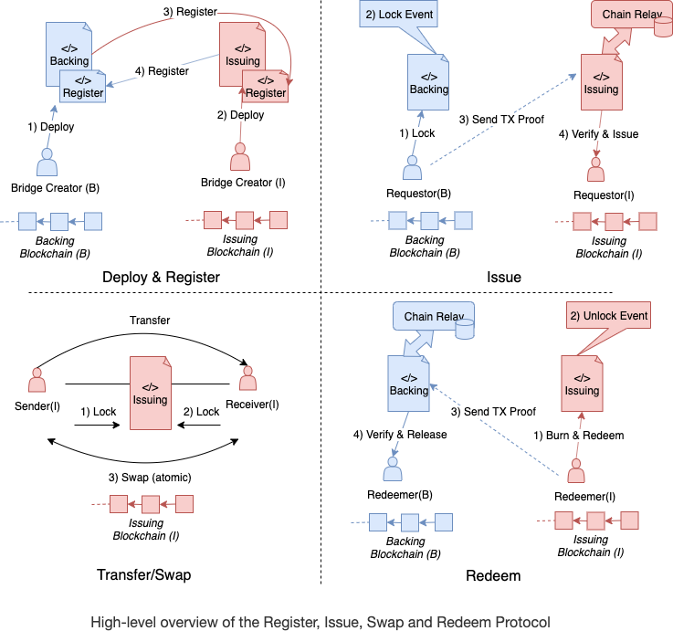
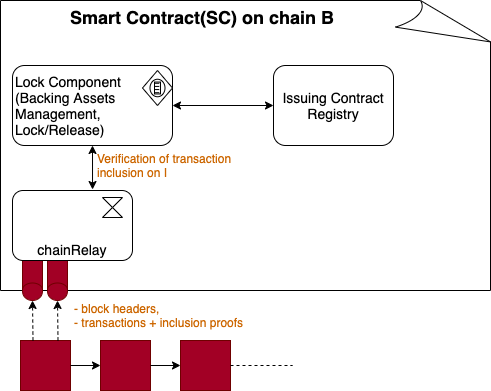

# Darwinia Bridge Core: Interoperation in ChainRelay Enabled Blockchains

## I. Abstract

XClaim[5] 针对 ACCS 的缺点，设计了通用的、高效低成本的跨链框架，并提出了Cryptocurrency-Bakced Assets (CBAs)的概念。其设计主要分成三个部分：

- 提出的CBA概念对跨链资产和原生资产的关系做了清晰的概括，是原生资产在另外一个区块链网络中存在形式的精简表达。
- 在发行链(Issuing Blockchain)一端，通过借助Chain Relay对另外一个链上的交易证明进行存在性和共识性的直接验证，而无需信任第三方。
- 在背书链(Backing Blockchain)一端，通过引入Vault、质押物(Collateral)和喂价等经济机制，对赎回过程的安全性实现了理性经济假设下的保证。由于存在质押物和喂价机制的约束，所以只能支持流动性较好的Fungible Token。

XClaim 虽然某种程度上解决了 ACCS 的缺点，但是也存在其自身的局限性：只针对Fungible Token有效，不支持NFT和其他流动性较差无法喂价和平仓的Fungible Token。此外，XClaim方案中因为Vault的质押物在跨链资产赎回之前都是锁定的，导致存在较高的质押成本，抵押物可能存在收益率不足的问题。

针对XClaim的以上问题，本文在保留CBA概念和大部分发行链的设计的同时，将背书链一端进行重新设计，增加对Backing Blockchain引入更多合理假设，即支持智能合约和Chain Relay(非BTC)，在背书链一端引入Chain Relay来验证发行链的交易，同时对背书锁定资产的赎回进行链上合约化的约束。通过这样的新方式，去除Vault、流动性质押、喂价等设计和模块，实现了对更广泛的Token的支持，包括NFT和流动性不好的Fungible Token。

## II. Introduction

对于不同区块链上的token交换，目前虽然中心化交易所可以帮助执行，但是这样的服务需要高度的信任，且易发生主动作恶、单点故障等问题。随着Cosmos、Polkadot这样一批优秀的跨链项目的落地，架构在跨链基础设施之上的去中心化token流通协议/方案也成为重要的研究内容。

在已有的方案中，atomic cross-chain swaps (ACCS) 是最早提出的可行性方案，但由于其跨链效率低、成本高，实际使用场景并不多。随后，XClaim (Cross Claim) 针对 ACCS 的缺点，提出了通用的、高效低成本的跨链框架，使用了Cryptocurrency-Bakced Assets (CBAs).

XClaim 虽然某种程度上解决了 ACCS 的缺点，但是也存在其自身的局限性：只针对Fungible Token有效，并且。目前针对NFT的跨链流通还没有通用框架。本文以双链互跨为例，通过对Backing Blockchain引入更多假设，即假设Backing Blockchain支持智能合约，提出基于双Chain Relay的改进版通用XClaim方案（同时适用于Fungible Token和NFT）。

该方案将展示Two chainRelay Model的设计思路和过程实现。[XClaim](https://eprint.iacr.org/2018/643.pdf)跨链方案已经可以保证了在大部分场合下的NFT的跨链安全操作，但是依然无法保证通证资产价格产生剧烈波动时，整个系统的鲁棒性和可持续性。

同时，本文还将着重分析chainRelay的实现成本和其改进方案，目前改进思路包括两个方案的探讨，其一，通过批量提交*block headers*，或对*block headers*构建*merkle tree*的方式压缩成本，其二，通过借助零知识证明的技术，将上传*block headers*成本降低，并提高链上验证交易的速度。

## III. Overview

在这一章节，我们首先回顾和定义一些XClaim中与本文有关的概念，以及系统的模型和参与其中的角色。

### A. Cryptocurrency-backed Assets(CBA)

**Definition.** We define *cryptocurrency-backed assets* (CBAs) as assets deployed on top of a blockchain *I* that are backed by a cryptocurrency on blockchain *B*. We denote assets in *I* as *i*, and cryptocurrency on *B* as *b*. We use *i(b)* to further denote when an asset on *I* is backed by *b*. We describe a CBA through the following fields:

- *issuing blockchain*, the blockchain *I* on which the CBA *i(b)* is issued.

- *backing blockchain*, the blockchain *B* that backs *i(b)* using cryptocurrency *b*.

- *asset value*, the units of the backing cryptocurrency *b* used to generate the asset *i(b)*.

- *asset redeemability*, whether or not *i(b)* can be redeemed on *B* for *b*.

- *asset owner*, the current owner of *i(b)* on *I*.

- *asset fungibility*, whether or not units of *i(b)* are inter-

  changeable.

### B. System Model and Actors

XCLAIM operates between a backing blockchain *B* of cryptocurrency *b* and an issuing blockchain *I* with underlying CBA *i(b)*. To operate CBAs, XCLAIM further differentiates between the following actors in the system:

- CBA Requester. Locks b on B to request i(b) on I.

- CBA Sender. Owns i(b) and transfers ownership to another

  user on I.

- CBA Receiver. Receives and is assigned ownership over

  i(b) on I.

- CBA Redeemer. Destroys i(b) on I to request the corre-

  sponding amount of b on B.

- CBA Backing Smart Constract(bSC). A public smart contract responsible for trust-free locking/releasing *b* as protocol design requires and liable for fulfilling redeem requests of i(b) for b on B, with support of chain relay to honestly follow the instructions from redeem requests from I. *bSC* is registered on *I* so that the issuing contracts on *I* will know the transactions happen to bSC.

- Issuing Smart Contract (iSC). A public smart contract responsible for managing the correct issuing and exchange of i(b) on I. The *iSC* is required to register on *bSC* so that the backing contracts on *B* will know the transactions happen to *iSC*, in this way, *iSC* ensures correct behaviour of the *bSC*, e.g. the release action in redeem protocol.

  To perform these roles in XCLAIM, actors are identified on a blockchain using their public/private key pairs. As a result, the requester, redeemer must maintain key pairs for both blockchains B and I. The sender and receiver only need to maintain key pairs for the issuing blockchain *I*. *iSC* exists as a publicly verifiable smart contract on *I*, and *bSC* exists as a publicly verifiable smart contract on *B*.

### C. 什么是 *chain relay*

XClaim 给出了对 *chain relay* [7]的定义：

> Chain relays: Cross-Chain State Verification. It is capable of interpreting the statte of the backing blockchain B and provide functionality comparable to an SPV or light client[10].

因此，*chain relay* 可以被认为是由包含root of merkle tree的区块头组成。它为 iSC 提供了两种功能： *交易存在证明* 以及 *共识证明*。

- ***交易存在证明***： *chain relay* 存储着区块链的每一个区块头，以及区块头里的root of merkle tree. 在提供merkle tree路径的情况下，这已经足够可以证明一笔交易是否存在于这条链的某个区块中。
- ***共识证明***： 以比特币为例，因为每个节点通常不能即时看到全网的情况，因此经常会发生产生孤块，又在重组中被丢弃的情况。为了避免这种情况带来的攻击/漏洞，*chain relay* 必须要验证给定的区块头是否为完整区块链的一部分，例如被大部分节点认可。对于共识为Proof-of-Work的区块链，*chain relay* 必须：(i) 知道挖矿难度调整策略  (ii) 验证收到的区块头是否在具有最多累计工作量证明的链上。 对于共识为Proof-of-Stake的区块链，*chain relay* 必须：(i) 知道协议要求/staking的阶段，例如epoch  (ii) 验证区块头中验证人签名数量是否满足区块的阈值要求。

[TODO: 图片来自于网络]

### D. 区块链模型和假设

在目前已经上线的区块链项目中，几乎没有NFT作为链的原生资产的，所有的NFT几乎都是在智能合约内实现的。因此，对原生资产所在的chain $B$, 可以引入全新且合理的假设：

- *Backing blockchain* 和 *Issuing blockchain*:  都支持图灵完备的智能合约

这样我们就可以通过在 $B$ 和 $I$ 上放置独立的智能合约 bSC 和 iSC 来提供更强的技术约束，保证跨链的安全性。

### E. System Goals

1. Support General Tokens
   - Workable for NFT
   - Workable for Fungible Tokens without liquidations on outside exchanges.
2. Economic Feasible
   - Backing contract does not require to provide a lot of collateral for the safety of redeem protocol
   - Feasible solutions for to support running low cost chain relay on backing blockchain.
3. Securty Properties(Ignore, refer the section in XClaim paper):
   - Audiability
   - Consitency
   - Redeemability
   - Liveness
   - Atomic Swaps
   - Scale-out
   - Compatiblity

## IV. Backing Contract Solution

**Backing Contract Solution**(two chain relay model)通过在Backing Blockchain上引入一个支持chain relay的智能合约，以实现背书资产*b*的托管锁定和赎回释放功能。因为有了chain relay的支持，所以Backing Contract将可以忠实的执行发行链*I*上的赎回指令，而不需担心资产的安全问题，也不用要求Backing Contract需要质押资产，因为Backing Contract 是可审计的，并且注册在*iSC*中，因此避免了中间人信任风险和单点故障问题。

相较于XClaim原始的方案，我们引入了完全无 $vault$ 质押的跨链方案，通过在backing blockchain上引入chain-relay来保证可赎回性和安全性。*chainRelay* 可以提供区块链的交易存在证明和共识证明，在XClaim的方案中，对chain $B$ 没有任何额外的要求，导致在 chain $B$ 上的安全只能由在 chain $I$ 上抵押 $i\_col$ 的 $vault$ 来提供。通过III-D中对 chain $B$ 引入的新的假设约束，可以在转接桥中实现***bSC + iSC***双向互相验证和互操作。例如，在赎回协议中， chain $B$ 上的资产安全可以非互操作性地实现，降低对 $vault$ 的依赖。

### A. Protocols

本方案提供五个协议：Register, Issue, Transfer, Swap and Redeem.

**Protocol: Register.** *bSC*需要在*iSC*中注册，*iSC*也需要在*bSC*中注册，这个相互注册过程需要公开可审计的，并通过注册完成之后的关闭外部(中心化的key的)注册权限的方式完成注册。Alice deploy an backing contract on B, and Dave deploy and issuing contract on I, and the backing contract and issuing contract require to register with each other.

1. Deploy. First, Alice deploy the backing contract on B, and Dave deploy the issuing contract on I.
2. Verify. Alice and Dave verify the counterpart's smart contracts.
3. Register&Setup. Alice register Backing contract on I and associate with Issuing contract. Dave register Issuing contract on B and associate with backing contract.
4. Finish. Backing and Issuing Contracts finish the permission-less register process. (Some permission closing TX may be required.)

**Protocol: Issue.** Alice (*requester*) locks units of *b* with the *backing contract* on B to create *i(b)* on I:

1. Lock. Alice generates a new pulic/private key pare on *I* and locks funds *b* with the backing contract on B in a publicly verifiable manner. i.e., by send *b* to the lock contract associated with backing contract. As part of locking these funds, Alice also specifies where the to-be-generated *i(b)* should be sent, i.e, Alice associates her public key on *I* with the transfer of *b* to the lock contract (linked to backing contract).
2. Check Finalization. Alice (or her running client) check the the finalization vailid status of the lock transaction before she do the next step.
3. Send Lock TX Proof. Alice send the lock transaction proof to *Issuing Contract* on *I* , the instruction in the proof and transaction also include the issue instructions.
4. Verify & Issue. After the issuing contract confirms via the TX proof and verify the validation that Alice has correctly locked her funds and forwards Alice's public key on I to iSC. The iSC verifies the proof, then issues and send i(b) to Alice, such that $||i(b)|| = ||b||$

**Protocol: Transfer.**Alice (*sender*) transfers *i(b)* to Dave (*receiver*) on I:

1. *Transfer.* Alice notifies the iSC that she wishes to transfer her i(b) to Dave (public key) on I. The state of the iSC is updated and Dave becomes the new owner of i(b).
2. *Witness.* The backing contract witnesses the change of ownership on I through iSC, and no longer allows Alice to withdraw the associated amount of locked b on B. The process for any further transfers from Dave to other users is analogous.

**Protocol: Swap**.Alice (sender) atomically swaps i(b) against Dave’s (receiver) i on I:

1. *Lock.* Alice locks i(b) with the iSC.

2. *Swap.* If Dave locks the agreed upon units of i (or any other asset on I) with the iSC within delay ∆swap, the iSC updates the balance of Dave, making him the new owner of i(b), and assigns Alice ownership over i.

3. *Revoke.* If Dave does not correctly lock i with the iSC within ∆swap, the iSC releases locked i(b) to Alice.

4. *Witness.* If the swap is successful, the backing contract witnesses the change of ownership of i(b) and no longer allows Alice to redeem the associated amount.

**Protocol: Redeem.**Dave (redeemer) burn i(b) with the iSC on I to receive b from the vault on B:

1. Burn & Redeem. Dave creates a new public/private key pair on B. and locks *i(b)* with the *iSC* on I and requests the redemption of *i(b)*. There by, Dave also specifies his new public key on *B* as the target for the redeem.

2. Check Finalization. Dave (or her running client) check the the finalization valid status of the lock transaction before she do the next step.

3. Send Burn TX Proof. Dave send the burn transaction proof to *bSC* on *B* , the instruction in the proof and transaction also include the redeem instructions.

4. Verify & Release.  After the backing contract confirms via the TX proof and verify the validation that Dave has correctly locked her funds and forwards Dave's public key on B to *bSC*. The *bSC* verifies the proof, then release funds *b* to Dave's specified public key on *B*, such that $||b|| = ||i(b)||$

### B. Issue Contract

由于有了Backing Contract，并消除了只需要质押资产的部分，因为相较于原先XClaim的方案，新的Issuing Contract得到了很大的简化。

### C. Backing Contract

Backing Contract用于替换原先XClaim中Vault的部分，并增加了智能合约和chain relay支持，通过在Backing Blockchain中引入chain relay，当发生赎回时，Backing Contract能够监听到Issuing Blockchain上的销毁动作，并进行交易验证，确认之后进行相应的背书资产释放动作。

#### D.  *chain relay* 如何去信任

这里以章节IV.A中的 *Protocol Issue* 为例，当 *requester* 把 $b$ 锁定在 $bSC$ 时，会产生一笔交易: $lock(backing_contract_address, lock_amount) - > T_l$ ，随后backing chain relay的 *witness* 会向 *chain relay* 提交这笔交易$T_l$ ，之后 *chain relay* 会检验 $T_l$ 确实是存在于给定区块的交易中(交易存在证明)，这个区块也存在于最长链中并有良好的终结性（共识证明），那么就证明背书资产&&b已经被安全地锁定了。如果验证通过，会原子地触发 *iSC* 中的资产发行操作。

## V. Darwinia Bridge Core - Chain Relay Topology Optimization

在两条公链中跨链转移token，需要在chain $I$ 维护 *chain relay* 的成本是很高的，例如以太坊上每笔交易需要gas。如果把两条公链之间的跨链行为扩展到任意 $n$ 公链的话，那么每条链上都需要单独维护 $n-1$ 个 iSC，总共将需要$C_n^2$个chain relay合约。为了降低系统的维护成本，考虑在基于substrate的平行链上实现跨链的核心功能。

### A. *Darwinia Bridge Core* 架构

那么整个系统的架构如下：

图中 **Bridge Core** 即为平行链上包含通证跨链和各chain relay的核心模块；**vSC** 为 **Bridge Core** 的对应链的资产的发行模块。和以前的跨链方案不同的是，在上图的架构中，所有链的token需要先跨入**Bridge Core**, 而后在 **Bridge Core** 内部转换到目的公链对应的iSC 中，最后再在对应公链上发行对应的资产，整个跨链操作即完成。

### B. Overview

[WIP]

## VI. Chain Relay Maintenance Cost and Improments

与XClaim方案相比，最终的区别是在Backing Blockchain中引入了Chain Relay和智能合约，用于验证交易存在证明和共识证明。这个方案最大的一个挑战就是就是如何降低维护chain relay的成本，尤其是像以太坊这样的燃料费比较贵的区块链网络。

为了验证交易，像Bitcoin和以太坊需要节点来验证一条链是有效的，其中牵涉到下载并并验证区块的有效性，可能会花费服务器数小时的时间和很多的带宽和存储，不用说链上的合约，即使是像普通的移动端这样仅有有限资源的客户端都无法支持。因此像Bitcoin和以太坊这样的大部分公链提供了轻客户端，也就是SPV(Simplified payment verification)客户端，可以只需要下载区块头就可以进行交易验证。但是即使如此，简单的SPV客户端仍需要下载很多的区块头数据，面对智能合约高昂的燃料费来说，实现起来仍然不切实际。

因此，本章节将注重于对不同的Chain Relay实现进行评估和分析，以求找到链上成本最低的方案。

### A. Cost Estimation

根据FlyClient[6]的描述，至2019年7月，一个以太坊的SPV客户端需要下载并存储4G的数据，如果采取类似的结构和设计，一个链上Chain Relay所需要下载并存储存储的数据也基本线性相关。

另一个可以评估的方案是[BTCRelay]([http://btcrelay.org](http://btcrelay.org/))的成本。[WIP]

### B. Improvements using FlyClient[6]

FlyClient[6]介绍了一种新的交易验证的轻客户端方案，可以支持多种区块链网络，包括POW区块链和POS区块链。

目前阶段，主要SPV客户端和BTCRelay方案的是，因为需要存储每一个区块头，导致其算法需要的存储和带宽要求是线性增长的。Fly Client通过组合 Merkle Moutain Range(MMR)[2]，最佳概率块抽样(Optimal probabilistic block sampling)，Fiat–Shamir heuristic等技术，可以实现算法性能达到对数级，也就是在每次执行校验期间只需要下载对数个区块头。

详细设计可参考[FlyClient: Super-Light Clients for Cryptocurrencies](https://eprint.iacr.org/2019/226)

FlyClient提供了super light client的方案，但是Chain Relay需要在区块链内置合约(模块)或者用户合约中实现super light client，因此在设计方案上需要增加一些考虑点：

- Asymptotically and on Demand Proof Summit and Challenge Time

  ChainRelay提交块头的如果只是一个人，则无法确认是诚实或是作恶的，或者说即使是善意的，提交的头也可能由于自然分叉而无效。在轻钱包协议中一个重要假设是轻钱包可以和多个全节点连接获得数据，并且至少其中一个是诚实的。所以，在我们的实现中，只有一个人提交头类似与只有一条连接，不足以确保数据的有效性。因此在用户使用这个ChainRelay的最新区块头及相关默克尔证明之前，需要增加一个Challenge时间，也就是最新的区块头被提交后，处于质疑状态，需要有一个challenge时段，在此时间过后没有人提交反对块（符合块基本交易且拥有更高难度，但MMR中不包含质疑块）或者收到赞同块（难度更高，但是MMR包含质疑块），最新提交的区块才被确认。此时，用户将可以使用这个Chain Relay验证在此最新块之前发生的交易是否存在。

  为了防止攻击者攻击，在提交块时需要附带一定金额的押金，在块被信任后，押金返回并附带一定比例的手续费池金额作为奖励；如果块被否决，则押金扣除，扣除的押金一部分进入手续费池，一部分直接奖励否决块的提交人（否决块也需要被信任后才成为否决块）。

- External Blockchain HardFork和治理机制

  一些公链可能会出现硬分叉的情况，这些硬分叉可能会导致共识机制的改变，相应的，其轻节点也需要升级，但是Chain Relay一般以去中心化的智能合约形式存在，例如在跨链转接桥中为去中心化的背书技术提供支持。如果提供升级权限账户，就会削弱其去中心化程度并引入单点故障，如果不提供，则改Chain Relay将升级以应对外部链的硬分叉。因此需要引入治理机制来处理升级问题。

  一般来说建议在应用状态验证合约进行治理升级的支持，例如如果出现硬分叉，则实现一个新的Chain Relay并部署，这个新的Chain Relay的Genesis则指向硬分叉块，所有依赖这个Chain Relay的应用状态验证合约，通过调整其Chain Relay指向逻辑，在硬分叉时，将旧的Chain Relay替换为新的Chain Relay，从而在保证Chain Relay去中心化的同时，提供应用层面升级的灵活性，应用层面可以选择应用不同的治理机制以及在治理和去中心化之间进行权衡。

- On-chain Crypto Verification Support

  Chain Relay需要对外部链上的交易证明进行验证，但是由于是在不同的链上，Chain Relay所在链可能不支持外部链交易所需的加密库，例如Ethereum 1.0目前还不支持BLS算法。因此如果需要广泛的支持不同的公链，需要考虑Chain Relay运行链是否支持相应的加密库。

- Consensus Support

  在Fly Client中，只针对类似Bitcoin和Ethereum这样的POW链提供了设计，针对其他的区块链共识(Poof of X)，例如POS，DPOS, PBFT等则没有详细描述，因此需要针对这些共识算法，设计相应的Super Light Client解决方案。[WIP]

  对于Darwinia 来说，为了方便的在不同的公链上开发针对Darwinia的Chain Relay，并保证较低的成本和复杂度，因此需要将Darwinia的共识算法设计成Super Light Client Friendly的共识算法。[WIP]

### C. Improvements using Zero-knowledge Proofs

[WIP]

## VI. 参考

1. https://github.com/sec-bit/zkPoD-lib
2. https://github.com/mimblewimble/grin/blob/master/doc/mmr.md
3. https://github.com/ipfs/specs/tree/master/merkledag
4. https://hackernoon.com/ipfs-and-merkle-forest-a6b7f15f3537
5. XClaim, https://eprint.iacr.org/2018/643.pdf
6. FlyClient, https://eprint.iacr.org/2019/226
7. https://zhuanlan.zhihu.com/p/72620891
8. https://lists.linuxfoundation.org/pipermail/bitcoin-dev/2016-May/012715.html
9. [Fiat Shamir heuristic](https://en.wikipedia.org/wiki/Fiat–Shamir_heuristic)
10. https://medium.com/blockchain-research-newsletter/blockchain-research-newsletter-3-nipopow-and-flyclient-ac202f7624a7
11. https://blog.kyber.network/waterloo-a-decentralized-practical-bridge-between-eos-and-ethereum-1c230ac65524
12. https://medium.com/@loiluu/peacerelay-connecting-the-many-ethereum-blockchains-22605c300ad3
13. https://steemit.com/eos/@attic-lab/eos-io-consensus-algorithm